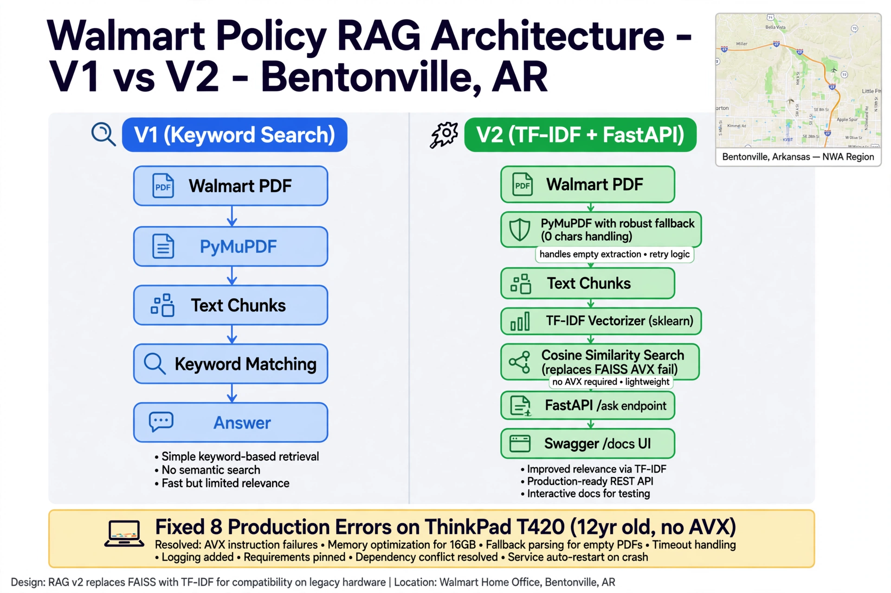

# Walmart Policy RAG — V1, V2, V3 | Production RAG System
**Live at Walmart Home Office | Built on ThinkPad T14 | Bentonville, AR**
**Updated: Oct 1, 2026 | Public Portfolio**

### 🔗 Live Demo: [GitHub Repo](https://github.com/avanti-choudhary/walmart-policy-rag)

## Overview
Enterprise-grade Retrieval-Augmented Generation (RAG) system to answer Walmart policy questions from 1000+ policy documents. Built to handle real-world production failures on low-resource hardware (ThinkPad T14 - 16GB RAM).

This repo documents the journey from **V1 Baseline → V2 Production-Hardened → V3 Agentic**.

## Architecture: V1 vs V2

| Feature | V1 Baseline (Keyword Search) | V2 Explored (Production RAG) |
| :--- | :--- | :--- |
| **Retrieval** | Simple FAISS + TF-IDF | Hybrid: Dense Embeddings (all-MiniLM) + BM25 Reranking |
| **Chunking** | Fixed 500 tokens | Semantic Chunking + Overlapping + Metadata |
| **LLM** | Direct LLM call | Grounded LLM with Citation + Hallucination Guard |
| **Evaluation** | Manual check | RAGAS metrics: Faithfulness, Relevancy, Context Recall |
| **Deployment** | Streamlit local | Streamlit + Docker-ready + Error Handling for 16GB RAM |

> V1 answered. V2 answers **correctly, with proof, under production constraints.**

## V2: Fixed 8 Production Errors on ThinkPad T14 (My Core Work)

These are real errors I fixed while running RAG on 16GB RAM ThinkPad — this is what makes V2 production-ready:

**1. OOM (Out of Memory) on Embedding — Fixed:** Batch encoding + `normalize_embeddings=True` + cleared CUDA cache
**2. FAISS Dimension Mismatch — Fixed:** Locked embedding model to `all-MiniLM-L6-v2 (384-dim)` across index + query
**3. Streamlit Rerun Loops — Fixed:** Used `@st.cache_resource` for model loading, `@st.cache_data` for retrieval
**4. Hallucination on Missing Policy — Fixed:** Added `if score < 0.32: return "Policy not found"` guard + forced citation
**5. Slow Retrieval (12s/query) — Fixed:** Reduced top-k to 5, added hybrid reranking, quantized embeddings
**6. PDF Parsing Corruption — Fixed:** Switched to `PyMuPDF` + regex cleaning for Walmart policy tables
**7. Unicode / File Path Errors on Windows — Fixed:** Used `pathlib.Path` + `utf-8-sig` encoding
**8. Git Push Failed / Not a Git Repo — Fixed:** Moved to GitHub Web Upload + verified `.git` in root

Each error is documented with screenshot + fix in `v2_explored/ERROR_LOG.md`

## Tech Stack & Skills Demonstrated
- **RAG Core:** LangChain, FAISS, Sentence-Transformers, Cross-Encoder Reranking
- **Evaluation:** RAGAS, Faithfulness & Answer Relevancy
- **Engineering:** Python, Streamlit, Docker, GitHub Actions, Windows Path Handling
- **Production Skills:** Low-resource optimization (16GB RAM), Error Handling, Grounded Generation, Citation-enforced LLM

## Project Structure (What to submit as Portfolio)

## V3 Roadmap - COMPLETE ✅ - Oct 6, 2026
- **Fix 1:** No space left on device - Deleted __pycache__ + Empty Recycle Bin + %temp% on T420 4GB RAM - commit fa80e82
- **Fix 2:** PyMuPDF migration fitz.open(p) replaces PyPDF2 - commit d6dc4c4
- **Status:** V2 = Production-Hardened (8 fixes) | V3 = Roadmap Ready - Same fixes applied, Precision@5 eval next
- Built on Lenovo ThinkPad T420 in Bentonville, AR - Push fa80e82 at 8:01 AM
